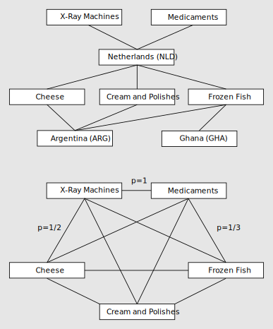

# The Mathematics of Economic Complexity

This section is adapted from [@atlas2014] but it differs at some points. In particular [@mesuringcomplexity2015] and [@interpretationreflections2014] provide useful technical details.

## Revealed Comparative Advantage (RCA)

When associating countries to products it is important to take into account the size of the export volume of countries and that of the world trade of products. this is because, even for the same product, we expect the volume of exports of a large country like China, to be larger than the volume of exports of a small country like Uruguay. By the same token, we expect the export volume of products that represent a large fraction of world trade, such as cars or footwear, to represent a larger share of a country's exports than products that account for a small fraction of world trade, like cotton seed oil or potato flour.

To make countries and products comparable we use Balassa's definition of Revealed Comparative Advantage (RCA). Balassa's definition says that a country has revealed Comparative advantage in a product if it exports more than its "fair" share, that is, a share that is equal to the share of total world trade that the product represents. For example, in 2008, with exports of \$42 billion, soybeans represented 0.35% of world trade. of this total, Brazil exported nearly \$11 billion, and since Brazil's total exports for that year were \$140 billion, soybeans accounted for 7.8% of Brazil's exports. This represents around 21 times Brazil's "fair share" of soybean exports (7.8% divided by 0.35%), so we can say that Brazil has revealed comparative advantage in soybeans.

Let $x_{c,p}$ represent the exports of country $c$ in product $p$, we can express the Revealed Comparative Advantage that country $c$ has in product $p$ as:

\begin{equation}
\renewcommand{\vec}[1]{\boldsymbol{#1}}
\newcommand{\R}{\mathbb{R}}
(\#eq:rca)
RCA_{c,p} = \frac{x_{c,p}}{\sum_c x_{c,p}} / \frac{\sum_p x_{c,p}}{\sum_{c}\sum_{p} x_{c,p}}
\end{equation}

## Smooth Revealed Comparative Advantage (SRCA)

We smooth changes in export volumes induced by the price fluctuation of commodities by using a modification of \@ref(eq:rca) in which $x_{c,p}$ is averaged over the previous three years by using weights:

$$
SRCA_{c,p}^{(t)} = \frac{\hat{x}_{c,p}^{(t)}}{\sum_c \hat{x}_{c,p}^{(t)}} / \frac{\sum_p \hat{x}_{c,p}^{(t)}}{\sum_{c}\sum_{p} \hat{x}_{c,p}^{(t)}}
$$

Where

$$
\hat{x}_{c,p}^{(t)} = \frac{2x_{c,p}^{(t)} + x_{c,p}^{(t-1)} + x_{c,p}^{(t-2)}}{4}
$$

Please notice this average is different to the original method presented in [@atlas2014].

We use this measure to construct a matrix that connects each country to the products that it makes. The entries in the matrix are 1 if country exports product with Revealed Comparative Advantage larger than 1, and 0 otherwise. We define this as the matrix $M \in \mathbb{R}^{C\times P}$ with entries:

\begin{equation}
(\#eq:Mcp)
m_{c,p} = \begin{cases}1 & \text{ if } SRCA_{c,p}^{(t)} \geq 1\cr 0 & \text{ otherwise}  \end{cases}
\end{equation}

$M$ is the matrix summarizing which country makes what, and is used to construct the product space and our measures of economic complexity for countries and products. Previous research has tested other values different than 1 to construct the matrix $M$ and found that the results are robust to these changes.

In order to compute some of the equations exposed here we had to reduce $M$ by removing cols and rows where each entry is zero. For some years the number of countries $C$ can be less than 128 as it was exposed in \@ref(data-processing). The number of products $P$ for a given year can also experience a small decrease. However, we smooth RCA magnitudes before computing $M$ to overcome this problem.

It is also important that beyond computability some products were intensively exported in past decades but then their were replaced by other products. Think of floppy disks exports or saltpeter exports.

## Diversity and Ubiquity

<!--
If we define $m_{c,p}$ as a matrix that is 1 if country $c$ produces product $p$, and 0 otherwise,
-->
With $M$ defined as in the previous sections, we can measure Diversity and Ubiquity simply by summing over the rows or columns of that matrix. 

We define Diversity as:
  
$$k_{c}^{(0)} = \sum_p m_{c,p}$$

And Ubiquity as:
$$k_{p}^{(0)} = \sum_c m_{c,p}$$

## Reflections Method

To generate a more accurate measure of the number of capabilities available in a country, or required by a product, we need to correct the information that diversity and ubiquity carry by using each one to correct the other. For countries, this requires us to calculate the average ubiquity of the products that it exports, the average diversity of the countries that make those products and so forth. For products, this requires us to calculate the average diversity of the countries that make them and the average ubiquity of the other products that these countries make. This can be expressed by the recursion:

\begin{equation}
(\#eq:kcn)
k_{c}^{(n)} = \frac{1}{k_{c}^{(0)}} \sum_p m_{c,p} k_{p}^{(n-1)}
\end{equation}

\begin{equation}
(\#eq:kpn)
k_{p}^{(n)} = \frac{1}{k_{p}^{(0)}} \sum_c m_{c,p} k_{c}^{(n-1)}
\end{equation}

We then insert \@ref(eq:kpn) into \@ref(eq:kcn) to obtain:

\begin{equation}
(\#eq:kcn2)
k_{c}^{(n)} = \sum_c \left[\frac{1}{k_{c}^{(0)}} \sum_p m_{c,p} \frac{1}{k_{p}^{(0)}} m_{c,p} \right] k_{c}^{(n-2)}
\end{equation}

The equation above can be conveniently written as a matrix equation^[This formulation takes some ideas from [@mesuringcomplexity2015] and [@interpretationreflections2014]:

\begin{equation}
(\#eq:kcn3)
\vec{k}^{(n)} = \tilde{M}\vec{k}^{(n-2)}
\end{equation}

Where

\begin{equation}
(\#eq:mcc)
\tilde{m}_{c,c'} = \frac{1}{k_{c}^{(0)}} \sum_p m_{c,p} \frac{1}{k_{p}^{(0)}} m_{c,p}
\end{equation}

In a similar way we can define $\hat{M}$ with entries:

\begin{equation}
(\#eq:mpp)
\hat{m}_{p,p'} = \frac{1}{k_{p}^{(0)}} \sum_c m_{c,p} \frac{1}{k_{c}^{(0)}} m_{c,p}
\end{equation}

We note \@ref(eq:kcn3) is satisfied when $k_{c}^{(n)} = k_{c}^{(n-2)} = 1$. This is the eigenvector of $\tilde{M}$ which is associated with its largest eigenvalue. Since this eigenvector is a vector of ones, it is not informative. We look, instead, for the eigenvector associated with the second largest eigenvalue. This is the eigenvector that captures the largest amount of variance in the system and is our measure of Economic Complexity.

In particular, the interpretation of the scores changes when considering odd or even iteration order $n$, high-order iterations are difficult to interpret, and the process asymptotically converges to a trivial fixed point.

For the analysis we used $n=19$ to compute $k_c$ and $n=20$ to compute $k_p$.

## Economic Complexity Index (ECI)

From the Reflections Method, we define the Economic Complexity Index (ECI) as:

\begin{equation}
(\#eq:eci)
ECI_c = \frac{v_c - \mu_{v}}{\sigma_{v}}
\end{equation}

Where

* $\vec{v}$ is an eigenvector of $\tilde{M}$ associated with its second largest eigenvalue.
* $\mu_v = \sum_c v_c / C$ (mean of $\vec{v}$) 
* $\sigma_v = \sqrt{\sum_c (v_c - \mu_v)^2 / (C - 1)}$ (standard deviation of $\vec{v}$)

## Product Complexity Index (PCI)

Similar to the Economic Complexity Index (ECI), we define a Product Complexity Index (PCI). Because of the symmetry of the problem, this can be done simply by exchanging the index of countries $c$ with that for products $p$ in the definitions above. We define PCI as:

\begin{equation}
(\#eq:pci)
PCI_p = \frac{w_p - \mu_{w}}{\sigma_{w}}
\end{equation}

Where

* $\vec{w}$ is an eigenvector of $\hat{M}$ associated with its second largest eigenvalue.
* $\mu_w = \sum_p w_p / P$ (mean of $\vec{w}$)
* $\sigma_w = \sqrt{\sum_p (w_p - \mu_w)^2 / (P - 1)}$ (standard deviation of $\vec{w}$)

## Product Proximity

To make products you need chunks of embedded knowledge which we call capabilities. The capabilities needed to produce one good may or may not be useful in the production of other goods. Since we do not observe capabilities directly, we create a measure that infers the similarity between the capabilities required by a pair of goods by looking at the probability that they are coexported. To quantify this similarity we assume that if two goods share most of the requisite capabilities, the countries that export one will also export the other. By the same token, goods that do not share many capabilities are less likely to be co-exported.

Our measure is based on the conditional probability that a country that exports product $p$ will also export product $p'$ (see figure). Since conditional probabilities are not symmetric we take the minimum of the probability of exporting product $p$, given $p'$ and the reverse, to make the measure symmetric and more stringent. For instance, in the year 2008, 17 countries exported wine, 24 exported grapes and 11 exported both, all with $RCA > 1$. then, the product proximity between wines and grapes is 11/24=0.46. Note that I divide by 24 instead of 17 to minimize false positives. For a pair of goods $p$ and $p'$ we define Product Proximity $\Phi \in \mathbb{R}^{P\times P}$ as:

<!--
$$
\Phi_{p,p'} = \frac{\sum_c m_{c,p} M_{c,p'}}{\max(k_{p}^{(0)}, k_{p'}^{(0)})}
$$
-->
$$
\Phi = (M^t M) \odot U
$$

Where $\odot$ denotes element-wise multiplication and 
$$u_{p,p'} = 1 / \max(k_{p}^{(0)}, k_{p'}^{(0)})$$

In other terms, each entry of $\Phi$ corresponds to:
$$
\phi_{p,p'} = \frac{\sum_c m_{c,p} m_{c,p'}}{\max(k_{p}^{(0)}, k_{p'}^{(0)})}
$$

```{r, echo = F, fig.cap="An illustrative example for the product proximity measure"}

```

## Country Proximity

Similar to \@ref(country-proximity), we define Country Proximity $\Lambda \in \mathbb{R}^{C\times C}$ as:

$$
\Lambda = (MM^t) \odot D
$$

Where 
$$d_{c,c'} = 1 / \max(k_{c}^{(0)}, k_{c'}^{(0)})$$

In other terms, each entry of $\Lambda$ corresponds to:
$$
\lambda_{c,c'} = \frac{\sum_p m_{c,p} m_{c,p'}}{\max(k_{c}^{(0)}, k_{c'}^{(0)})}
$$

## Product Density

This concept appears in [@productspace2007], however the matricial formulation is not a part of the original article.

Product Density is the weighted mean proximity of a new potential product $p$ to a country’s current productive capability. In formal terms this is the matrix $\Psi \in \mathbb{R}^{C\times P}$ defined by:

$$
\Psi = (M\Phi) \oslash (\hat{M}\Phi)
$$

Where $\hat{m}_{c,p} = 1$ and $\oslash$ denotes element-wise division.

In other terms, each entry of $\Psi$ corresponds to:
$$
\psi_{c,p} = \frac{\sum_{p} m_{c,p} \phi_{p,p'}}{\sum_{p} \phi_{p,p'}}
$$

## Country Density

Similar to \@ref(product-density), we define Country Density as the matrix $\Omega \in \mathbb{R}^{C\times P}$:

$$
\Omega = (\Lambda M) \oslash (\Lambda\hat{M})
$$

In other terms, each entry of $\Omega$ corresponds to:
$$
\omega_{c,p} = \frac{\sum_{c} m_{c,p} \phi_{c,c'}}{\sum_{c} \phi_{c,c'}}
$$
