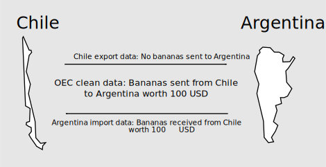

# Data Processing

## Tidy Data

We followed Tidy Data principles to obtain an output that in our opinion can be useful for others. Those principles are closely tied to those of relational databases and Codd’s relational algebra. We did not innovate at this point and we only limited to follow the principles exposed in [@tidydata2014] and [@r4ds2016] above all matters related to performing code and coding style.

(\#fig:unnamed-chunk-1)Data pipeline

## Filling some gaps in our data

For each NA or 0 import/export value we tried to fill the gap. If country A reported NA or 0 exports (imports) of product B to (from) country C, then we searched what country C reported of imports (exports) of product B from (to) country A. The column `marker` indicated those replacements under this labels:

|marker|meaning                              |
|------|-------------------------------------|
|1     |imports with replacements            |
|2     |exports with replacements            |
|3     |imports and exports with replacements|
|NA    |no replacements needed               |

(\#fig:unnamed-chunk-2)Criteria to replace null imports or exports

## Classification conversion in monthly data

As [UN COMTRADE](https://comtrade.un.org/data/) states: "Monthly datasets may mix codes from multiple HS revisions and are provided as is except for standardization of trade flow and partner information, as well as conversion to US dollars."

Our solution to obtain tidy datasets was to convert all HS codes available in raw datasets to HS rev 2007. In \@ref(materials-of-interest) we provide links to correspondence tables that allow us to do that conversion process.

## Countries not included in rankings and indicators

The curated data includes all the countries available from UN Comtrade data. However, RCA based calculations such as ECI, PCI, Proximity and Density explained in Chapter \@ref(the-mathematics-of-economic-complexity) consider 128 countries that account for 99% of world trade, 97% of the world’s total GDP and 95% of the world’s population according to [@atlas2014].

We considered simultaneously:

* Countries with population greater or equal to 1.2 million
* Countries whose traded value is greater or equal than 1 billion

(\#fig:unnamed-chunk-3)Schematic of the procedure used to determine the countries that were included in the Atlas

## Scripts on GitHub

### Getting and cleaning data from UN COMTRADE

* [OEC Yearly Data](https://github.com/observatory-economic-complexity/oec-yearly-datasets)
* [OEC Monthly Data](https://github.com/observatory-economic-complexity/oec-monthly-datasets)

### Scraping data in The Atlas of Economic Complexity

* [OEC Atlas Data](https://github.com/observatory-economic-complexity/oec-atlas-data)

### Product space layouts

* [OEC Product Space](https://github.com/observatory-economic-complexity/oec-product-space)

### Product and country codes

* [OEC Observatory Codes](https://github.com/observatory-economic-complexity/oec-observatory-codes)
* [OEC Comtrade Codes](https://github.com/observatory-economic-complexity/oec-comtrade-codes)

## Software versions

At the moment we are using R 3.4.3 under Ubuntu Server 16.04 and our IDE is RStudio Server Pro 1.1.

We built R from binaries in order to obtain a setup linked with multi-threaded BLAS/LAPACK libraries. Our built is linked to Intel MKL 2017 but our results can be reproduced if your R setup is linked to OpenBLAS or your system's default, only performance differences should be noticed.

## Hardware information

Our server features Intel© Xeon 2.27GHz (eight cores) processor and 32 GB (four DDR3 cards of eight gigabytes each).

The functions are executed using parallelization on four cores because empirically we detected and overhead due to data communication with the cores when using more cores.

Please notice that running our scripts with parallelization demands more RAM than the amount you can find on an average laptop. 

## Reproducibility notes

To guarantee reproducibility each of our repositories contains a [Packrat](https://rstudio.github.io/packrat/) library that is a snapshot of the R packages we are using. This prevents us from changes in syntax, functions or dependencies. Even our R installation is isolated from apt-get to avoid any accidental update that can change our results.

Some projects are linked. In order to avoid multiple copies of files some projects read files from other projects. For example, [OEC Yearly Indicators](https://github.com/observatory-economic-complexity/oec-yearly-indicators) input is the output of [OEC Yearly Datasets](https://github.com/observatory-economic-complexity/oec-yearly-datasets) and [OEC Atlas Data](https://github.com/observatory-economic-complexity/oec-atlas-data).

The only reproducibility flaw of this project lies in data downloading. Obtaining raw datasets from UN COMTRADE demands an API key that can only be obtained from institutional access. In my case Professor Cesar A. Hidalgo gave me temporary access.

This project will not work on Windows without code edition. Multicore functionality supports multiple workers only on those operating systems that support the fork system call, and this excludes Windows.

## Coding style and performant code

We used [Tidyverse Style Guide](http://style.tidyverse.org/). As cornerstone references for performant code we followed [@advancedr2014] and [@masteringsoftware2017].

Some matrix operations are written in Rcpp to take advantage of C++ speed. To take full advantage of hardware and numerical libraries we are using sparse matrices as it is explained in [@rcpparmadillo2018].

## Materials of interest

* [List of countries in the Atlas (scraped from the original PDF)](https://github.com/observatory-economic-complexity/oec-atlas-data/blob/master/2-atlas-countries.csv)
* [Country names with equivalency between UN numeric code, ISO 2 and ISO 3 (UN COMTRADE)](https://github.com/observatory-economic-complexity/oec-comtrade-codes/blob/master/country-codes.xls?raw=true)
* [UN COMTRADE product classifications](https://github.com/observatory-economic-complexity/oec-comtrade-codes/blob/master/official-list-of-comtrade-codes.xlsx?raw=true)
* [Layouts to visualize the product space](https://github.com/observatory-economic-complexity/oec-product-space/tree/master/hs92-sitc/2-layouts-rpackage)
* [Layouts to visualize the product space (for D3plus 2)](https://github.com/observatory-economic-complexity/oec-product-space/tree/master/hs92-sitc/3-layouts-d3plus2)

UN COMTRADE product classifications may be of interest as it includes all trade classifications levels with detailed description of: (i) Harmonized System revisions 1992 (H0/HS92), 1996 (H1), 2002 (H2), 2007 (H3), 2012 (H4), 2017 (H5); Standard International Trade classification revisions 1 (S1), 2 (S2), 3 (S3), (iii) and 4 (S4); and Broad Economic Categories (BE).
